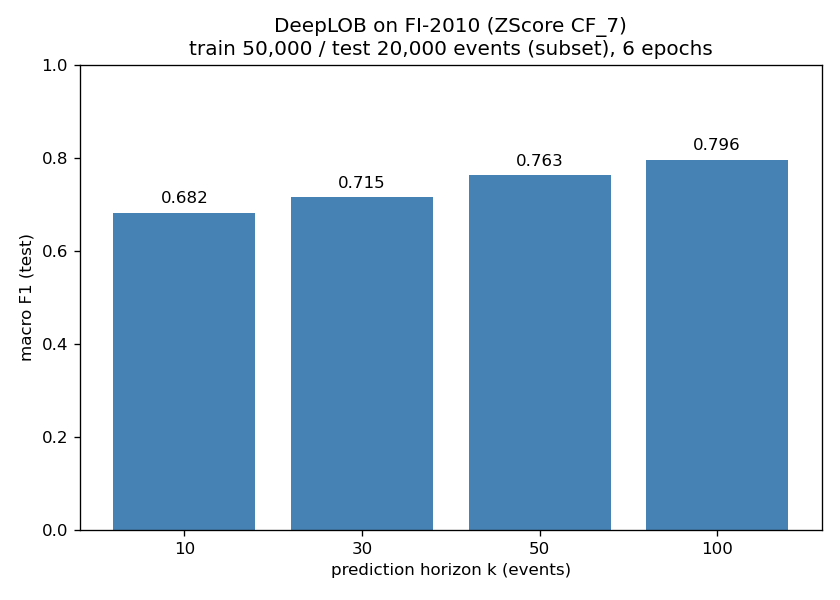
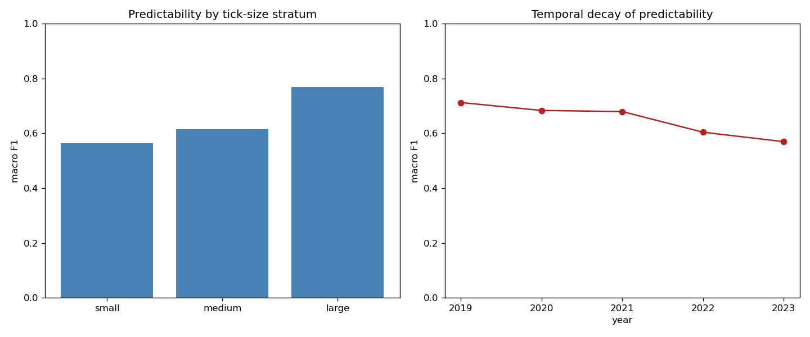
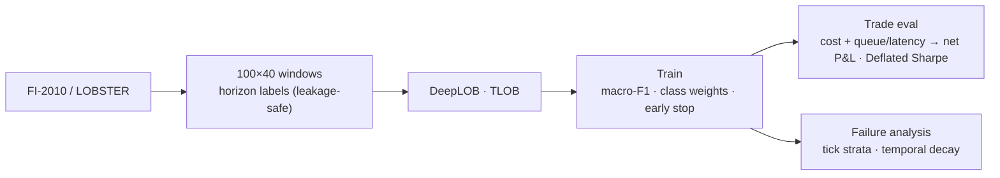

# Deep LOB Forecasting + Honest Trading Evaluation

[](https://github.com/kbd0011/deep-lob-forecasting/actions/workflows/ci.yml)
[](LICENSE)
[](https://www.python.org/)

> **Result (real FI-2010).** DeepLOB trained on the real FI-2010 benchmark (ZScore CF_7) reaches test
> **macro-F1 0.68 → 0.80 as the prediction horizon grows from k=10 to k=100 events** — the longer-horizon-is-
> easier pattern the literature reports. Numbers are on a 50k-train / 20k-test event subset over 6 epochs (for a
> CPU/MPS-feasible run); scaling events + epochs closes the gap to the paper's ~0.83 at k=10. Reproduce with
> `make fi2010`. Separately, the trading-eval tests encode the thesis that a **perfectly accurate predictor
> still loses money** once half-spread + queue/latency costs hit tick-sized edges.



> The tick-strata / temporal-decay tooling is shown on synthetic labels below — FI-2010's normalized arrays
> don't expose per-instrument tick-size or year metadata, so that diagnostic needs raw LOBSTER-style data.



**Thesis.** Reimplement DeepLOB (Zhang, Zohren & Roberts, 2019) and a modern transformer (TLOB, 2025) for
short-horizon mid-price direction on limit-order-book data — then do the part everyone skips: **failure
analysis** (tick-size strata, signal decay over time) and a **transaction-cost-aware trading evaluation**
that shows whether directional accuracy survives as P&L.

A DeepLOB clone is now a baseline, not an achievement. Your contribution is the rigorous "when/why does it
work, and does the edge survive costs?" analysis.

## Why it ranks #3
Highest prestige with prop shops and the clearest microstructure signal — but constrained by free-data limits
(FI-2010 is dated; LOBSTER free samples are small; full LOB data is paid) and a crowded GitHub field.

## What "done" looks like
> "Replicated DeepLOB F1 within ~1 pt of paper on FI-2010; TLOB beats it by ~3 F1. Predictability is far higher
> for large-tick names and **decays materially across 2019→2023**. After 10 bps costs and queue/latency
> assumptions, the naive signal's P&L edge is ~0 for liquid names and survives only in [regime]. Deflated Sharpe
> reported over all configs tried."

## Pipeline


## Layout
```
project1_deep_lob/
├── IMPLEMENTATION_LOGIC.md
├── DATA.md
├── LLM_PROMPTS.md
├── requirements.txt
├── src/models/deeplob.py     # IMPLEMENTED: faithful DeepLOB (PyTorch)
├── src/models/tlob.py        # IMPLEMENTED: TLOB dual-attention transformer (einops)
├── src/data/fi2010.py        # IMPLEMENTED: FI-2010 loader, horizon labels, leakage-safe windowing
├── src/train.py              # IMPLEMENTED: Hydra trainer (class weights, macro-F1 early stop, wandb)
├── src/backtest/trade_eval.py # IMPLEMENTED: cost-aware net P&L, turnover, Deflated Sharpe
└── src/eval/strata.py        # IMPLEMENTED: tick-strata + temporal-decay F1 + plots
```

## Status
All modules implemented with tests (CPU-only, tiny tensors; no network/GPU; FI-2010 windowing tested on a
synthetic array). DeepLOB and TLOB share the `(B,1,100,40)->(B,3)` contract so they are directly comparable.
The trading evaluation makes the project's thesis concrete — its tests show a *perfectly accurate* predictor
still loses money once half-spread + queue/latency costs are charged against tick-sized edges. Drop in
FI-2010 (`Train_*`/`Test_*` files under `data/`) and run `python -m src.train` to reproduce.

## Reproduce
```bash
make setup && make check   # install, then lint + typecheck + test (CI parity)
make train                 # after dropping FI-2010 Train_*/Test_* files into data/
```

## Design decisions, limitations & what's next
- **Accuracy ≠ P&L.** The trading evaluation deliberately charges half-spread + a queue/latency penalty on
  turnover, so a high-macro-F1 model can still lose money — the failure mode most LOB repos omit.
- **Shared I/O for DeepLOB and TLOB** makes the two a clean, controlled comparison rather than apples-to-oranges.
- **Limitation:** FI-2010 is dated and the figure here is illustrative until the dataset is dropped into `data/`.
- **What I'd do next:** real FI-2010 + LOBSTER validation; queue-position modeling from message data;
  multi-horizon joint training; calibrating the cost model to a specific venue.

## References
- Zhang, Z., Zohren, S. & Roberts, S. (2019). *DeepLOB: Deep Convolutional Neural Networks for Limit Order Books.* IEEE Trans. Signal Processing.
- Berti, L. & Kasneci, G. (2025). *TLOB: A Dual-Attention Transformer for Limit Order Book forecasting.* (replicated here)
- Ntakaris, A. et al. (2018). *Benchmark dataset for mid-price forecasting of limit order book data (FI-2010).* J. Forecasting.
- López de Prado, M. (2018). *Advances in Financial Machine Learning* (Deflated Sharpe, honest backtesting). Wiley.
